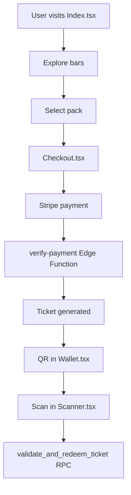

# Gravity Gate Pass - Calle San Juan Tapas Route

Digital ticketing platform for the famous Calle San Juan Tapas Route in Logroño, Spain. Allows purchasing digital packs of tapas and wines, and redeeming them via QR codes at participating bars. [1](#2-0) 

## 🎯 Key Features

### For Customers
- **Bar Discovery**: Explore participating establishments on Calle San Juan with search and filtering [2](#2-1) 
- **Digital Purchase**: Secure checkout process with Stripe integration [3](#2-2) 
- **Digital Wallet**: Store and manage your purchased tapas packs
- **QR Codes**: Unique QR codes with dual-signature system to prevent fraud

### For Staff
- **QR Scanner**: Quick ticket validation on mobile
- **Access Control**: Only scan at assigned bars
- **Activity Logging**: Complete audit trail of all redemptions

### For Administrators
- **Bar Management**: Catalog of establishments and offers
- **Price Configuration**: Define packs and availability
- **Monitoring**: Real-time logs and statistics
- **User Management**: Roles and permissions

## 🏗️ Technical Architecture

### Frontend
- **React 18** with TypeScript and Vite
- **Tailwind CSS** with glassmorphism design
- **shadcn/ui** accessible components
- **Framer Motion** for animations
- **React Router** for navigation

### Backend
- **Supabase** as BaaS (Backend-as-a-Service)
  - PostgreSQL for database
  - Integrated authentication
  - Edge Functions with Deno
  - Row Level Security (RLS)

### Integrations
- **Stripe**: Payment processing
- **Supabase Auth**: User and role management
- **Google Maps**: Location visualization

## 📁 Project Structure

```
src/
├── components/          # Reusable UI components
│   ├── ui/             # Base components (shadcn/ui)
│   ├── AppNav.tsx      # Main navigation
│   ├── EventCard.tsx   # Bar/event card
│   └── Footer.tsx      # Footer
├── pages/              # Application pages
│   ├── Index.tsx       # Main landing
│   ├── Checkout.tsx    # Purchase flow
│   ├── Scanner.tsx     # QR scanner for staff
│   ├── Dashboard.tsx   # Admin panel
│   └── Wallet.tsx      # Digital wallet
├── hooks/              # Custom hooks
├── integrations/       # Supabase configuration
└── lib/                # Utilities
```

## 🚀 Local Setup

### Prerequisites
- Node.js 18+
- Bun (recommended) or npm
- Supabase account
- Stripe account (for testing)

### Installation
```bash
# Clone repository
git clone https://github.com/ibim4ster/gravity-gate-pass.git
cd gravity-gate-pass

# Install dependencies
bun install

# Configure environment variables
cp .env.example .env.local
# Edit .env.local with your credentials

# Start development
bun dev
```

### Environment Variables
```env
VITE_SUPABASE_URL=your_supabase_url
VITE_SUPABASE_ANON_KEY=your_supabase_anon_key
VITE_STRIPE_PUBLISHABLE_KEY=your_stripe_key
```

## 🔐 Security Model

The system implements multiple security layers:

1. **Dual QR Signature**: Each ticket contains `qr_code|qr_signature` to prevent spoofing [4](#2-3) 
2. **Row Level Security**: Row-level access policies in Supabase
3. **User Roles**: `admin`, `staff`, `client` with differentiated permissions
4. **Idempotent Validation**: Duplicate prevention in ticket creation

## 📊 User Flow



## 🎨 Design & Branding

- **Color Palette**: Based on Calle San Juan identity
  - Primary: Green (#228c22)
  - Secondary: Warm cream
  - Accent: Light sand
- **Typography**: DM Sans for headers
- **Style**: Glassmorphism with `backdrop-blur-xl` [5](#2-4) 

## 📱 Main Pages

| Page | Route | Description |
|------|-------|-------------|
| **Home** | `/` | Bar discovery and search |
| **Checkout** | `/checkout/:eventId/:tierId` | Purchase flow |
| **Wallet** | `/wallet` | User ticket management |
| **Scanner** | `/scanner` | QR validation (staff) |
| **Dashboard** | `/dashboard` | Admin panel |
| **Contact** | `/contacto` | New bar registration |

## 🔧 Edge Functions

### `create-payment`
Creates Stripe checkout session to initiate payment process.

### `verify-payment`
Processes Stripe webhook, creates tickets idempotently.

### `admin-manage-user`
Admin function for user management with `service_role`.

## 📋 Database

### Main Tables
- `events`: Participating bars/establishments
- `price_tiers`: Pack and price configuration
- `tickets`: Generated tickets with QR and status
- `scan_logs`: Scan audit log
- `user_roles`: User role assignments

## 🚀 Deployment

### Frontend (Vercel/Netlify)
```bash
bun build
# Deploy dist/ folder
```

### Backend (Supabase)
```bash
supabase login
supabase link --project-ref your-project
supabase db push
supabase functions deploy
```

## 📄 License

© 2026 Gravity · Ruta de Pinchos Calle San Juan · Logroño [6](#2-5) 

---

## Notes

This README is based on the current architecture of the Gravity Gate Pass project. The system is specifically designed for the Spanish market and the "Ruta de Pinchos" of Logroño, with Spanish localization and cultural adaptation to the context of La Rioja. [2](#2-1) 

Yes, you can have multiple README files for different languages. Common practices include:
- `README.md` (English - default)
- `README.es.md` (Spanish)
- `README.fr.md` (French)
- etc.

GitHub and most platforms will automatically display the default README.md, while language-specific versions can be linked in the main README or accessed directly.

Wiki pages you might want to explore:
- [Glossary (ibim4ster/gravity-gate-pass)](/wiki/ibim4ster/gravity-gate-pass#6)

### Citations

**File:** src/pages/Checkout.tsx (L209-216)
```typescript
          <Button size="lg" disabled={!isFormValid || loading} onClick={handlePurchase}
            className="w-full font-display font-semibold rounded-xl shadow-lg shadow-primary/20">
            {loading ? (
              <><Loader2 className="w-4 h-4 mr-2 animate-spin" />Redirigiendo a pago...</>
            ) : (
              `Pagar ${totalPrice}€${quantity > 1 ? ` (${quantity}x)` : ''}`
            )}
          </Button>
```

**File:** src/pages/TicketView.tsx (L162-162)
```typescript
    pdf.text(ticket.qr_code, w / 2, y, { align: 'center' });
```

**File:** src/components/Footer.tsx (L13-15)
```typescript
          <p className="text-sm text-muted-foreground leading-relaxed">
            La ruta de pinchos más famosa de Logroño. Compra tus packs y canjéalos con QR en los mejores bares de la Calle San Juan.
          </p>
```

**File:** src/components/Footer.tsx (L38-38)
```typescript
        <p className="text-xs text-muted-foreground">© {new Date().getFullYear()} Gravity · Ruta de Pinchos Calle San Juan · Logroño</p>
```
