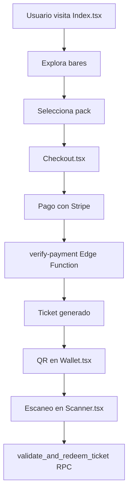

# Gravity Gate Pass - Ruta de Pinchos Calle San Juan

Plataforma de ticketing digital para la famosa Ruta de Pinchos de la Calle San Juan en Logroño, España. Permite comprar packs digitales de pinchos y vinos, y canjearlos mediante códigos QR en los bares participantes.

## 🎯 Características Principales

### Para Clientes
- **Descubrimiento de Bares**: Explora los establecimientos participantes en Calle San Juan con búsqueda y filtrado
- **Compra Digital**: Proceso de checkout seguro con Stripe integrado
- **Billetera Digital**: Almacena y gestiona tus packs de pinchos comprados
- **QR Codes**: Códigos QR únicos con sistema de firma dual para evitar fraudes

### Para Staff
- **Escáner QR**: Validación rápida de tickets en móvil
- **Control de Acceso**: Solo pueden escanear en los bares asignados
- **Registro de Actividad**: Auditoría completa de todos los canjes

### Para Administradores
- **Gestión de Bares**: Catálogo de establecimientos y ofertas
- **Configuración de Precios**: Definición de packs y disponibilidad
- **Monitorización**: Logs en tiempo real y estadísticas
- **Gestión de Usuarios**: Roles y permisos

## 🏗️ Arquitectura Técnica

### Frontend
- **React 18** con TypeScript y Vite
- **Tailwind CSS** con diseño glassmorphism
- **shadcn/ui** componentes accesibles
- **Framer Motion** para animaciones
- **React Router** para navegación

### Backend
- **Supabase** como BaaS (Backend-as-a-Service)
  - PostgreSQL para base de datos
  - Autenticación integrada
  - Edge Functions con Deno
  - Row Level Security (RLS)

### Integraciones
- **Stripe**: Procesamiento de pagos
- **Supabase Auth**: Gestión de usuarios y roles
- **Google Maps**: Visualización de ubicación

## 📁 Estructura del Proyecto

```
src/
├── components/          # Componentes UI reutilizables
│   ├── ui/             # Componentes base (shadcn/ui)
│   ├── AppNav.tsx      # Navegación principal
│   ├── EventCard.tsx   # Tarjeta de bar/evento
│   └── Footer.tsx      # Pie de página
├── pages/              # Páginas de la aplicación
│   ├── Index.tsx       # Landing principal
│   ├── Checkout.tsx    # Flujo de compra
│   ├── Scanner.tsx     # Escáner QR para staff
│   ├── Dashboard.tsx   # Panel de administración
│   └── Wallet.tsx      # Billetera digital
├── hooks/              # Hooks personalizados
├── integrations/       # Configuración de Supabase
└── lib/                # Utilidades
```

## 🚀 Configuración Local

### Prerrequisitos
- Node.js 18+
- Bun (recomendado) o npm
- Cuenta de Supabase
- Cuenta de Stripe (para pruebas)

### Instalación
```bash
# Clonar el repositorio
git clone https://github.com/ibim4ster/gravity-gate-pass.git
cd gravity-gate-pass

# Instalar dependencias
bun install

# Configurar variables de entorno
cp .env.example .env.local
# Editar .env.local con tus credenciales

# Iniciar desarrollo
bun dev
```

### Variables de Entorno
```env
VITE_SUPABASE_URL=your_supabase_url
VITE_SUPABASE_ANON_KEY=your_supabase_anon_key
VITE_STRIPE_PUBLISHABLE_KEY=your_stripe_key
```

## 🔐 Modelo de Seguridad

El sistema implementa múltiples capas de seguridad:

1. **Firma Dual QR**: Cada ticket contiene `qr_code|qr_signature` para evitar spoofing
2. **Row Level Security**: Políticas de acceso a nivel de fila en Supabase
3. **Roles de Usuario**: `admin`, `staff`, `client` con permisos diferenciados
4. **Validación Idempotente**: Prevención de duplicados en creación de tickets

## 📊 Flujo de Usuario



## 🎨 Diseño y Branding

- **Paleta de Colores**: Basada en la identidad de Calle San Juan
  - Primary: Verde (#228c22)
  - Secondary: Crema cálido
  - Accent: Arena clara
- **Tipografía**: DM Sans para headers
- **Estilo**: Glassmorphism con `backdrop-blur-xl`

## 📱 Páginas Principales

| Página | Ruta | Descripción |
|--------|------|-------------|
| **Inicio** | `/` | Descubrimiento de bares y búsqueda |
| **Checkout** | `/checkout/:eventId/:tierId` | Flujo de compra |
| **Billetera** | `/wallet` | Gestión de tickets del usuario |
| **Escáner** | `/scanner` | Validación de QR (staff) |
| **Dashboard** | `/dashboard` | Panel de administración |
| **Contacto** | `/contacto` | Registro de nuevos bares |

## 🔧 Edge Functions

### `create-payment`
Crea sesión de checkout en Stripe para iniciar el proceso de pago.

### `verify-payment`
Procesa webhook de Stripe, crea tickets de forma idempotente.

### `admin-manage-user`
Función administrativa para gestión de usuarios con `service_role`.

## 📋 Base de Datos

### Tablas Principales
- `events`: Bares/establecimientos participantes
- `price_tiers`: Configuración de packs y precios
- `tickets`: Tickets generados con QR y estado
- `scan_logs`: Registro de auditoría de escaneos
- `user_roles`: Asignación de roles a usuarios

## 🚀 Despliegue

### Frontend (Vercel/Netlify)
```bash
bun build
# Desplegar la carpeta dist/
```

### Backend (Supabase)
```bash
supabase login
supabase link --project-ref your-project
supabase db push
supabase functions deploy
```

## 📄 Licencia

© 2026 Gravity · Ruta de Pinchos Calle San Juan · Logroño

---

## Notes

Este README está basado en la arquitectura actual del proyecto Gravity Gate Pass. El sistema está específicamente diseñado para el mercado español y la "Ruta de Pinchos" de Logroño, con localización en español y adaptación cultural al contexto de La Rioja.

Wiki pages you might want to explore:
- [Getting Started (ibim4ster/gravity-gate-pass)](/wiki/ibim4ster/gravity-gate-pass#1.1)
- [Admin & Staff Tools (ibim4ster/gravity-gate-pass)](/wiki/ibim4ster/gravity-gate-pass#3)
